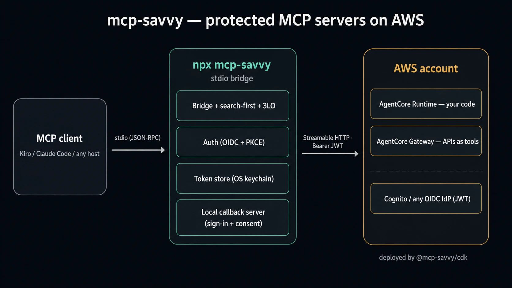

# mcp-savvy

[](https://www.npmjs.com/package/mcp-savvy)

> The expert MCP deployer, so you only deal with your app.

> **Disclaimer:** `mcp-savvy` is an independent, opinionated open-source
> project. It is not an official AWS, Anthropic, or Model Context
> Protocol resource, and is not affiliated with or endorsed by them.
> Provided as-is under the [MIT license](./LICENSE) — see
> [SECURITY.md](./SECURITY.md) for the threat model and what's out of
> scope.

`mcp-savvy` is a stdio bridge **and** a CDK toolkit for shipping
**protected MCP servers on AWS**. Drop a one-liner into your MCP
client config and your agent talks to a JWT-authenticated AgentCore
Runtime or Gateway over Streamable HTTP. Stand up the backend with a
few lines of CDK.

[](./ARCHITECTURE.md)

## When to use mcp-savvy

Use it when your MCP server runs on AWS AgentCore behind JWT/OIDC, but
your users need a simple local `npx` entry point with browser sign-in,
secure token storage, Gateway 3LO, or search-first tool flattening. It
bridges MCP's local **stdio** transport to remote **Streamable HTTP** and
pairs that client with reusable CDK constructs for the protected backend
([MCP transport and authorization boundary](https://modelcontextprotocol.io/specification/2025-06-18/basic/transports),
[AgentCore MCP hosting](https://docs.aws.amazon.com/bedrock-agentcore/latest/devguide/runtime-mcp.html)).

Skip it when your MCP host already handles the remote server's OAuth
flow directly, the server is local or unauthenticated, or the caller is
service-to-service using IAM SigV4 without a human browser login.

See [COMPARISON.md](./COMPARISON.md) for the full alternatives and
buy-vs-build tradeoffs.

## Quickstart

Runs via [`npx`](https://docs.npmjs.com/cli/v10/commands/npx) — no
global install, Node 20+. Drop this into your MCP client config
(`~/.kiro/settings/mcp.json`, Claude Desktop's config, etc.):

```json
{
  "mcpServers": {
    "my-protected-mcp": {
      "command": "npx",
      "args": ["-y", "mcp-savvy"],
      "env": {
        "MCP_SAVVY_REMOTE_URL": "https://....bedrock-agentcore.us-east-1.amazonaws.com/mcp",
        "MCP_SAVVY_OIDC_ISSUER": "https://cognito-idp.us-east-1.amazonaws.com/us-east-1_xxx",
        "MCP_SAVVY_CLIENT_ID": "your-app-client-id"
      }
    }
  }
}
```

First run pops a browser tab for sign-in; the token caches in your OS
keychain. Subsequent runs are silent until refresh expires. Every
`MCP_SAVVY_*` var is documented in [`.env.example`](./.env.example).

## Tool modes

By default the bridge runs in `passthrough` mode: it forwards the
upstream `tools/list` verbatim, so the host sees every real tool. For
backends with a large tool catalog, set `MCP_SAVVY_TOOL_MODE` to
collapse the surface down to two synthetic tools
(`${prefix}_search` + `${prefix}_call`) that search and invoke the
real tools on demand:

```json
{
  "env": {
    "MCP_SAVVY_REMOTE_URL": "...",
    "MCP_SAVVY_OIDC_ISSUER": "...",
    "MCP_SAVVY_CLIENT_ID": "...",
    "MCP_SAVVY_TOOL_MODE": "search-local"
  }
}
```

| Mode (`MCP_SAVVY_TOOL_MODE`) | Tools host sees               | When to use                                                                                                                                                                           |
| ---------------------------- | ----------------------------- | ------------------------------------------------------------------------------------------------------------------------------------------------------------------------------------- |
| `passthrough` (default)      | every upstream tool, verbatim | small catalogs (≤10 tools), demos, debugging                                                                                                                                          |
| `search-local`               | 2 synthetic (search + call)   | many tools, cost-sensitive — filters a local cache, $0 search cost                                                                                                                    |
| `search-gateway`             | 2 synthetic (search + call)   | many tools, quality-sensitive — forwards to [AgentCore Gateway semantic search](https://docs.aws.amazon.com/bedrock-agentcore/latest/devguide/gateway-using-mcp-semantic-search.html) |

Full comparison and wire details in [FEATURES.md](./FEATURES.md#search-first-tool-flattening).

## Examples

Each example deploys end-to-end with `make example-<name>-deploy` and
ships a short README inside its folder with the specifics.

| Example                                                | What it shows                                                                                                                       |
| ------------------------------------------------------ | ----------------------------------------------------------------------------------------------------------------------------------- |
| [`minimal-mcp`](./examples/minimal-mcp/)               | Smallest possible protected MCP — Cognito + AgentCore Runtime + one echo tool. Validates the client without any extra moving parts. |
| [`gateway-lambda-mcp`](./examples/gateway-lambda-mcp/) | Expose existing Lambda functions as MCP tools through an AgentCore Gateway. No agent layer.                                         |
| [`gateway-3lo-mcp`](./examples/gateway-3lo-mcp/)       | The "list my GitHub repos" demo — Gateway with a GitHub OpenAPI target and full third-party OAuth (3LO).                            |
| [`kb-mcp`](./examples/kb-mcp/)                         | Strands agent on AgentCore Runtime grounded on a Bedrock Knowledge Base.                                                            |
| [`gateway-kb-mcp`](./examples/gateway-kb-mcp/)         | The same KB fronted by a Gateway Lambda target — no agent.                                                                          |
| [`chatgpt-app-mcp`](./examples/chatgpt-app-mcp/)       | Banking-grade ChatGPT App with a sandboxed widget — model sees a safe summary, the actual amount lives only in tool-result `_meta`. |
| [`identity-providers`](./examples/identity-providers/) | Docs-only. Per-IdP setup notes: Entra, Okta, Auth0, Keycloak.                                                                       |

`make help` lists every target.

## Documentation

| Doc                                  | What's in it                                                |
| ------------------------------------ | ----------------------------------------------------------- |
| [ARCHITECTURE.md](./ARCHITECTURE.md) | What we build, how the pieces fit, the example matrix       |
| [COMPARISON.md](./COMPARISON.md)     | Alternatives: bridges, AWS-native tooling, managed gateways |
| [FEATURES.md](./FEATURES.md)         | Long-form features: tool modes, 3LO, CDK constructs, IdPs   |
| [SECURITY.md](./SECURITY.md)         | Threat model and what's in/out of scope                     |
| [`.env.example`](./.env.example)     | Every `MCP_SAVVY_*` env var with inline docs                |

New here? Start with [ARCHITECTURE.md](./ARCHITECTURE.md) for the
*what* and *why*, then pick the example closest to what you want to
build.

## Development

`pnpm` monorepo, audited by [fon](https://fon.ginylil.com/).

```sh
make help            # list targets
make verify          # full pre-commit gate (build + typecheck + test + fon + doc drift)
make architecture    # regenerate ARCHITECTURE.md from examples/*/example.yaml
```

Operating rules for agents in [AGENTS.md](./AGENTS.md).

## License

[MIT](./LICENSE).
